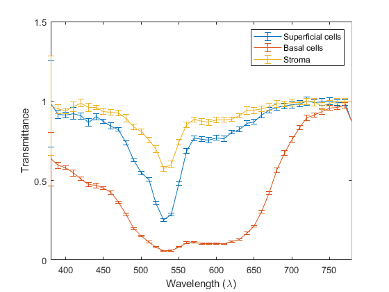

# Hyperspectral Microscope (HIMS) tissue transmittance measurements reader

This code was developped to read the transmittance hyperspectral data measured by DIDSR's Hyperspectral Imaging MicroScope (HIMS) of a selection of 8 BiomaxOrgan10 tissue microarray slides (US Biomax, 15883 Crabbs Branch Way, MD 20855, USA):

| Tissue Name | Position |
| --- | :---: |
| Bladder | M13 |
| Brain | H10 |
| Breast | A1 |
| Colon | H6 |
| Kidney | H7 |
| Liver | H9 |
| Lung | J7 |
| Uterine Cervix | B10 |

It outputs the CIE1931 XYZ and CIE1976 L\*a\*b\* coordinates and their covariance matrices. It also outputs the sRGB coordinates of the image.

## Disclaimer

This software and documentation (the "Software") were developed at the Food and Drug Administration (FDA) by employees of the Federal Government in the course of their official duties. Pursuant to Title 17, Section 105 of the United States Code, this work is not subject to copyright protection and is in the public domain. Permission is hereby granted, free of charge, to any person obtaining a copy of the Software, to deal in the Software without restriction, including without limitation the rights to use, copy, modify, merge, publish, distribute, sublicense, or sell copies of the Software or derivatives, and to permit persons to whom the Software is furnished to do so. FDA assumes no responsibility whatsoever for use by other parties of the Software, its source code, documentation or compiled executables, and makes no guarantees, expressed or implied, about its quality, reliability, or any other characteristic. Further, use of this code in no way implies endorsement by the FDA or confers any advantage in regulatory decisions. Although this software can be redistributed and/or modified freely, we ask that any derivative works bear some notice that they are derived from it, and any modified versions bear some notice that they have been modified.

## Example
"ExampleCode.m" provides an example on how to read and display input data and computed outputs for the Uterine Cervix tissue sample. It creates an instance of the ReadSpectralData class that accepts as inputs the hyperspectral data measured by the HIMS (from 380 nm to 780 nm in steps on 10 nm):
- Mean value of the transmittance for each wavelength
- Standard deviation of the transmittance for each wavelength

and outputs for each pixel in the image:
- The CIE 1931 tri-stimulus coordinates, CIEXYZ
- The covariance matrix on the CIEXYZ coordinates
- The CIELab 1976 coordinates, CIELAB
- The covariance matrix on the CIELAB coordinates
- The sRGB coordinates

Note: The covariance matrices computations are not used in the "ExampleCode.m" script.

The input data are provided for each of the 8 selected tissues in the /input/\<Tissue Name\>/Transmittance subfolder. For the example presented: [input/UterineCervix_red/Transmittance](https://github.com/plemaillet/read_spectral_data/tree/master/input/UterineCervix_red/Transmittance)

The CIEXYZ coordinates of the reference white and the resulting color coordinates (CIEXYZ, CIEYxy and CIELAB) for a selection of pixels location corresponding to superficial cells, basal cells and stroma are displayed. A tiff image is obtained by reshaping the sRGB coordinates:

  

For this selection of pixels positions, the measured transmittance are displayed plotting the spectral mean values of the transmittance. An errorbar plot of the spectral mean values and standard deviation of the transmittance is also presented:

	
	 

The color of these plots can follow the color order from Matlab or the sRGB color computed from the data. The CIEXYZ, CIELAB and sRGB data can be viusualized using a 3D scatter plot:

 

	
	 
	 

### ExampleCode.m
The uterine tissue was selected for clear stratification of the squamous mucosa and stroma. The light pink region in S points to the stroma of the uterine sample. T and U point to different regions of the squamous epithelium; the former being the midzone, or stratum spongiosum, and the latter being the basal cell layer.

  

